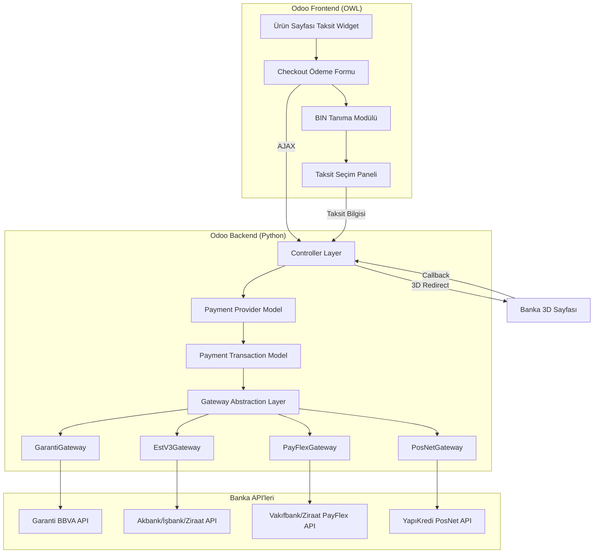
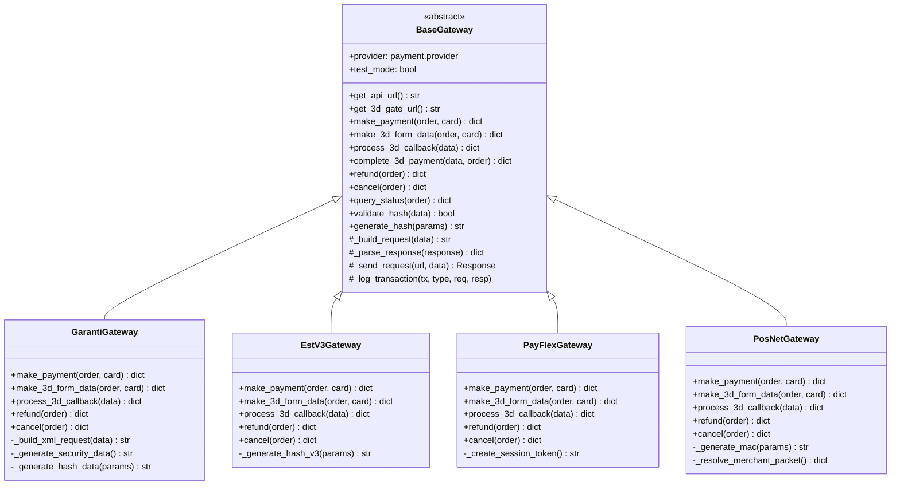
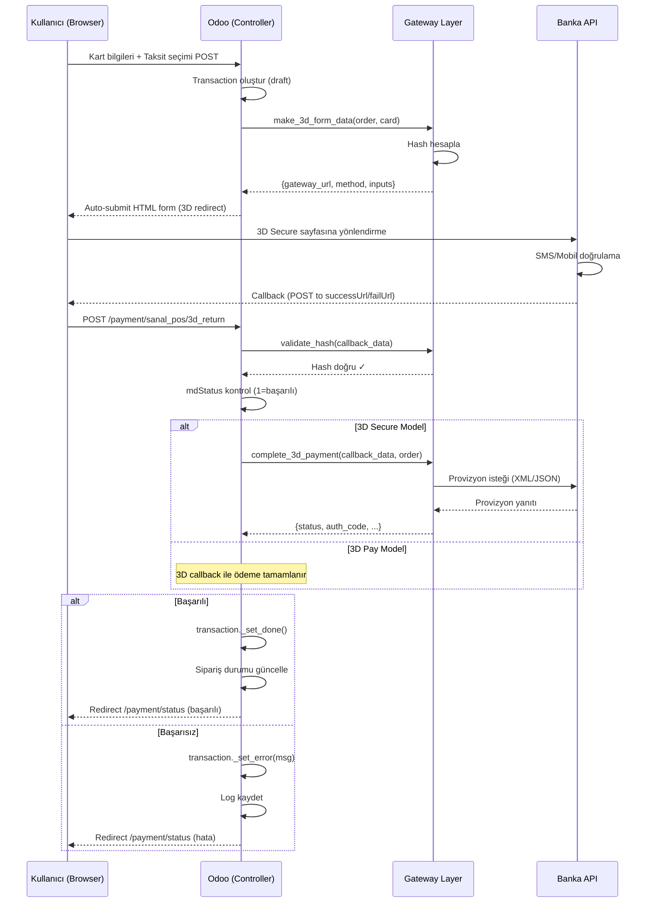
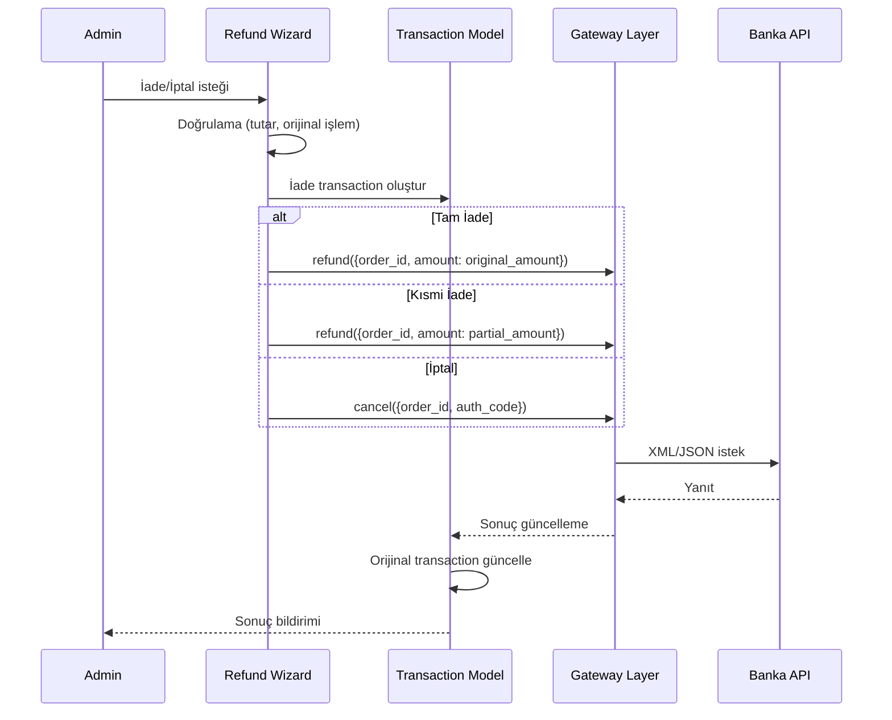

# Odoo 19 Türkiye Sanal POS Ödeme Sistemi

## 1. Genel Mimari



## 2. Modül Dizin Yapısı

```
payment_sanal_pos/
├── __init__.py
├── __manifest__.py
├── security/
│   └── ir.model.access.csv
├── data/
│   ├── payment_provider_data.xml          # Provider kayıtları (Garanti, Akbank vb.)
│   ├── payment_method_data.xml            # Ödeme yöntemi tanımları
│   ├── bin_data.csv                       # BIN veritabanı (~1400 kayıt)
│   ├── installment_default_data.xml       # Varsayılan taksit oranları
│   └── cron_data.xml                      # Zamanlanmış görevler (BIN güncelleme)
├── models/
│   ├── __init__.py
│   ├── payment_provider.py                # Ana provider modeli (Odoo extend)
│   ├── payment_transaction.py             # Transaction modeli (Odoo extend)
│   ├── sanal_pos_gateway.py               # Gateway konfigürasyon modeli
│   ├── sanal_pos_bin.py                   # BIN veritabanı modeli
│   ├── sanal_pos_installment.py           # Taksit tanımları modeli
│   ├── sanal_pos_installment_rate.py      # Taksit oranları modeli
│   ├── sanal_pos_category_rate.py         # Kategori bazlı oran modeli
│   ├── sanal_pos_transaction_log.py       # Detaylı log modeli
│   └── product_template.py               # Product template extend
├── gateways/
│   ├── __init__.py
│   ├── base_gateway.py                    # Abstract gateway sınıfı
│   ├── garanti_gateway.py                 # Garanti BBVA gateway
│   ├── estv3_gateway.py                   # EstV3 (Akbank, İşbank, Ziraat)
│   ├── payflex_gateway.py                 # PayFlex (Vakıfbank, Ziraat)
│   ├── posnet_gateway.py                  # PosNet (YapıKredi)
│   ├── request_builder.py                # XML/JSON request oluşturucu
│   ├── response_parser.py                # Response parse edici
│   ├── hash_helper.py                     # Hash hesaplama yardımcısı
│   └── exceptions.py                      # Gateway özel hataları
├── controllers/
│   ├── __init__.py
│   ├── main.py                            # Ana controller (3D callback, webhook)
│   └── installment_api.py                # Taksit bilgisi REST API
├── wizards/
│   ├── __init__.py
│   ├── refund_wizard.py                   # İade wizard
│   └── cancel_wizard.py                   # İptal wizard
├── views/
│   ├── payment_provider_views.xml         # Provider form/tree view
│   ├── gateway_config_views.xml           # Gateway ayarları view
│   ├── installment_views.xml             # Taksit yönetim view
│   ├── installment_rate_views.xml        # Taksit oran view
│   ├── category_rate_views.xml           # Kategori oran view
│   ├── bin_views.xml                      # BIN veritabanı view
│   ├── transaction_log_views.xml         # Log görüntüleme view
│   ├── refund_wizard_views.xml           # İade wizard view
│   ├── cancel_wizard_views.xml           # İptal wizard view
│   └── menus.xml                          # Ana menü tanımları
├── static/
│   ├── src/
│   │   ├── js/
│   │   │   ├── installment_widget.js      # Ürün sayfası taksit tablosu OWL
│   │   │   ├── payment_form.js            # Ödeme sayfası OWL bileşeni
│   │   │   ├── bin_detector.js            # BIN tanıma modülü
│   │   │   └── installment_selector.js    # Taksit seçim bileşeni
│   │   ├── xml/
│   │   │   ├── installment_widget.xml     # Taksit widget QWeb template
│   │   │   ├── payment_form.xml           # Ödeme formu QWeb template
│   │   │   └── installment_selector.xml   # Taksit seçici template
│   │   └── scss/
│   │       └── sanal_pos.scss             # Özel stiller
│   └── description/
│       ├── icon.png
│       └── index.html
└── tests/
    ├── __init__.py
    ├── test_gateway_garanti.py
    ├── test_gateway_estv3.py
    ├── test_gateway_payflex.py
    ├── test_gateway_posnet.py
    ├── test_installment.py
    ├── test_bin_detection.py
    └── test_transaction_flow.py
```

## 3. `__manifest__.py`

```python
{
    'name': 'Türkiye Sanal POS Ödeme Sistemi',
    'version': '19.0.1.0.0',
    'category': 'Accounting/Payment Providers',
    'summary': 'Türk bankalarıyla sanal POS entegrasyonu - Taksit, 3D Secure, BIN tanıma',
    'author': 'Proje Ekibi',
    'depends': [
        'payment',
        'website_sale',
        'sale',
        'account',
    ],
    'data': [
        'security/ir.model.access.csv',
        'data/payment_method_data.xml',
        'data/payment_provider_data.xml',
        'data/installment_default_data.xml',
        'data/cron_data.xml',
        'views/menus.xml',
        'views/payment_provider_views.xml',
        'views/gateway_config_views.xml',
        'views/installment_views.xml',
        'views/installment_rate_views.xml',
        'views/category_rate_views.xml',
        'views/bin_views.xml',
        'views/transaction_log_views.xml',
        'views/refund_wizard_views.xml',
        'views/cancel_wizard_views.xml',
        'wizards/refund_wizard.py',  # wizard view XML'de
    ],
    'assets': {
        'web.assets_frontend': [
            'payment_sanal_pos/static/src/js/installment_widget.js',
            'payment_sanal_pos/static/src/js/payment_form.js',
            'payment_sanal_pos/static/src/js/bin_detector.js',
            'payment_sanal_pos/static/src/js/installment_selector.js',
            'payment_sanal_pos/static/src/xml/installment_widget.xml',
            'payment_sanal_pos/static/src/xml/payment_form.xml',
            'payment_sanal_pos/static/src/xml/installment_selector.xml',
            'payment_sanal_pos/static/src/scss/sanal_pos.scss',
        ],
    },
    'post_init_hook': '_post_init_hook',  # BIN veritabanı yükleme
    'installable': True,
    'application': False,
    'license': 'LGPL-3',
}
```

## 4. Model Tasarımları

### 4.1 `payment.provider` Extend

**Dosya**: `models/payment_provider.py`

```python
class PaymentProvider(models.Model):
    _inherit = 'payment.provider'

    # --- Yeni selection değerleri ---
    code = fields.Selection(
        selection_add=[
            ('sanal_pos_garanti', 'Garanti BBVA'),
            ('sanal_pos_estv3', 'EstV3 (Akbank/İşbank/Ziraat)'),
            ('sanal_pos_payflex', 'PayFlex (Vakıfbank)'),
            ('sanal_pos_posnet', 'PosNet (YapıKredi)'),
        ],
        ondelete={
            'sanal_pos_garanti': 'set default',
            'sanal_pos_estv3': 'set default',
            'sanal_pos_payflex': 'set default',
            'sanal_pos_posnet': 'set default',
        }
    )

    # --- Gateway Kimlik Bilgileri ---
    sanal_pos_merchant_id = fields.Char(string='Merchant/Üye İşyeri No')
    sanal_pos_terminal_id = fields.Char(string='Terminal No')
    sanal_pos_store_key = fields.Char(string='Store Key / 3D Secure Anahtar')
    sanal_pos_provision_user = fields.Char(string='Provizyon Kullanıcı Adı')
    sanal_pos_provision_password = fields.Char(string='Provizyon Şifresi')
    sanal_pos_refund_user = fields.Char(string='İade Kullanıcı Adı')
    sanal_pos_refund_password = fields.Char(string='İade Şifresi')

    # --- API Endpoint'leri ---
    sanal_pos_api_url = fields.Char(string='API URL (Production)')
    sanal_pos_api_url_test = fields.Char(string='API URL (Test)')
    sanal_pos_3d_gate_url = fields.Char(string='3D Gate URL (Production)')
    sanal_pos_3d_gate_url_test = fields.Char(string='3D Gate URL (Test)')

    # --- Taksit Ayarları ---
    sanal_pos_installment_active = fields.Boolean(string='Taksit Aktif', default=True)
    sanal_pos_max_installment = fields.Integer(string='Maksimum Taksit Sayısı', default=12)
    sanal_pos_min_installment_amount = fields.Float(string='Minimum Taksit Tutarı (TL)', default=100.0)
    sanal_pos_installment_config_ids = fields.One2many(
        'sanal.pos.installment', 'provider_id', string='Taksit Konfigürasyonları'
    )

    # --- Genel Ayarlar ---
    sanal_pos_gateway_type = fields.Selection([
        ('garanti', 'Garanti BBVA'),
        ('estv3', 'EstV3 (Asseco/Payten)'),
        ('payflex', 'PayFlex MPI VPOS'),
        ('posnet', 'PosNet'),
    ], string='Gateway Tipi')
    sanal_pos_bank_name = fields.Selection([
        ('garanti', 'Garanti BBVA'),
        ('akbank', 'Akbank'),
        ('isbank', 'Türkiye İş Bankası'),
        ('yapikredi', 'Yapı Kredi'),
        ('ziraat', 'Ziraat Bankası'),
        ('vakifbank', 'Vakıfbank'),
        ('halkbank', 'Halkbank'),
        ('finansbank', 'QNB Finansbank'),
        ('teb', 'TEB'),
        ('denizbank', 'Denizbank'),
        ('kuveytturk', 'Kuveyt Türk'),
    ], string='Banka')
    sanal_pos_3d_secure_active = fields.Boolean(string='3D Secure Zorunlu', default=True)
    sanal_pos_payment_model = fields.Selection([
        ('3d_secure', '3D Secure'),
        ('3d_pay', '3D Pay'),
        ('3d_host', '3D Host'),
        ('non_secure', 'Non-Secure (3D\'siz)'),
    ], string='Ödeme Modeli', default='3d_secure')

    # --- Computed / Helper ---
    sanal_pos_active_api_url = fields.Char(compute='_compute_active_api_url')
    sanal_pos_active_3d_url = fields.Char(compute='_compute_active_3d_url')

    # --- Metodlar ---
    def _compute_active_api_url(self):
        """Test/prod moduna göre aktif API URL döndürür"""

    def _compute_active_3d_url(self):
        """Test/prod moduna göre aktif 3D URL döndürür"""

    def _get_supported_currencies(self):
        """TRY, USD, EUR destekli para birimleri"""

    def _compute_feature_support_fields(self):
        """Odoo feature support: refund=partial, tokenization=none"""

    def _get_default_payment_method_codes(self):
        """return ['card'] - sanal_pos kodları için"""

    def _sanal_pos_get_gateway(self):
        """Gateway factory - doğru gateway instance döndürür"""
        # gateway_type'a göre ilgili gateway sınıfını oluşturur
```

### 4.2 `payment.transaction` Extend

**Dosya**: `models/payment_transaction.py`

```python
class PaymentTransaction(models.Model):
    _inherit = 'payment.transaction'

    # --- Sanal POS Ek Alanlar ---
    sanal_pos_order_id = fields.Char(string='Banka Sipariş No', index=True)
    sanal_pos_auth_code = fields.Char(string='Yetkilendirme Kodu')
    sanal_pos_rrn = fields.Char(string='RRN (Retrieval Reference Number)')
    sanal_pos_transaction_id = fields.Char(string='Banka Transaction ID')
    sanal_pos_host_ref_num = fields.Char(string='Host Referans Numarası')

    # --- 3D Secure Bilgileri ---
    sanal_pos_3d_status = fields.Selection([
        ('not_enrolled', 'Kart Kayıtlı Değil'),
        ('enrolled', 'Kart Kayıtlı'),
        ('authenticated', 'Doğrulandı'),
        ('attempted', 'Denendi'),
        ('failed', 'Başarısız'),
    ], string='3D Secure Durumu')
    sanal_pos_md_status = fields.Char(string='MD Status')
    sanal_pos_eci = fields.Char(string='ECI Değeri')
    sanal_pos_cavv = fields.Char(string='CAVV')
    sanal_pos_xid = fields.Char(string='XID')

    # --- Taksit Bilgileri ---
    sanal_pos_installment_count = fields.Integer(string='Taksit Sayısı', default=1)
    sanal_pos_installment_amount = fields.Float(string='Taksit Tutarı')
    sanal_pos_total_with_interest = fields.Float(string='Toplam Tutar (Faizli)')
    sanal_pos_interest_rate = fields.Float(string='Uygulanan Faiz Oranı (%)')

    # --- Kart Bilgileri (Maskeli) ---
    sanal_pos_card_type = fields.Selection([
        ('visa', 'Visa'), ('mastercard', 'Mastercard'), ('troy', 'Troy'),
        ('amex', 'American Express'),
    ], string='Kart Tipi')
    sanal_pos_masked_pan = fields.Char(string='Maskeli Kart No')  # 4531****1234
    sanal_pos_card_bank = fields.Char(string='Kart Bankası')

    # --- İade/İptal Bilgileri ---
    sanal_pos_refund_amount = fields.Float(string='İade Edilen Tutar')
    sanal_pos_refund_date = fields.Datetime(string='İade Tarihi')
    sanal_pos_cancel_date = fields.Datetime(string='İptal Tarihi')
    sanal_pos_original_tx_id = fields.Many2one(
        'payment.transaction', string='Orijinal İşlem', ondelete='set null'
    )

    # --- Ham Banka Yanıtı ---
    sanal_pos_raw_request = fields.Text(string='Gönderilen Request (Debug)')
    sanal_pos_raw_response = fields.Text(string='Banka Yanıtı (Debug)')
    sanal_pos_error_code = fields.Char(string='Hata Kodu')
    sanal_pos_error_message = fields.Text(string='Hata Mesajı')

    # --- Odoo Override Metodlar ---
    def _get_specific_rendering_values(self, processing_values):
        """3D form datası hazırla: gateway URL, form inputs"""

    def _get_tx_from_notification_data(self, provider_code, notification_data):
        """3D callback'ten gelen veriden transaction bul"""

    def _process_notification_data(self, notification_data):
        """Banka yanıtını işle, durumu güncelle"""

    def _sanal_pos_process_3d_callback(self, data):
        """3D callback işleme - hash doğrula, ödeme tamamla"""

    def _set_done(self, **kwargs):
        """Başarılı ödeme - sipariş durumunu güncelle"""

    def _set_error(self, msg, **kwargs):
        """Hatalı ödeme - log yaz, bildiri gönder"""
```

### 4.3 `sanal.pos.installment` - Taksit Tanım Modeli

**Dosya**: `models/sanal_pos_installment.py`

```python
class SanalPosInstallment(models.Model):
    _name = 'sanal.pos.installment'
    _description = 'Sanal POS Taksit Konfigürasyonu'
    _order = 'provider_id, card_network, installment_count'

    provider_id = fields.Many2one('payment.provider', string='Ödeme Sağlayıcı',
                                   required=True, ondelete='cascade')
    card_network = fields.Selection([
        ('visa', 'Visa'), ('mastercard', 'Mastercard'),
        ('troy', 'Troy'), ('amex', 'American Express'),
    ], string='Kart Ağı', required=True)
    installment_count = fields.Integer(string='Taksit Sayısı', required=True)
    interest_rate = fields.Float(string='Faiz Oranı (%)', digits=(5, 2), default=0.0)
    is_active = fields.Boolean(string='Aktif', default=True)
    min_amount = fields.Float(string='Minimum Tutar (TL)', default=0.0)
    max_amount = fields.Float(string='Maksimum Tutar (TL)', default=0.0)
    # Ürün kategorisine özel oran override
    category_rate_ids = fields.One2many(
        'sanal.pos.category.rate', 'installment_id', string='Kategori Bazlı Oranlar'
    )

    _sql_constraints = [
        ('unique_installment', 'unique(provider_id, card_network, installment_count)',
         'Aynı provider, kart ağı ve taksit sayısı için tekrar tanım yapılamaz.'),
    ]

    def calculate_installment_amount(self, total_amount, category_id=None):
        """Taksit tutarını hesapla, kategori bazlı oran varsa onu kullan
        Returns: dict(monthly_amount, total_amount, interest_amount, rate)
        """
```

### 4.4 `sanal.pos.category.rate` - Kategori Bazlı Oran

**Dosya**: `models/sanal_pos_category_rate.py`

```python
class SanalPosCategoryRate(models.Model):
    _name = 'sanal.pos.category.rate'
    _description = 'Kategori Bazlı Taksit Oranı'

    installment_id = fields.Many2one('sanal.pos.installment', required=True, ondelete='cascade')
    category_id = fields.Many2one('product.category', string='Ürün Kategorisi', required=True)
    interest_rate = fields.Float(string='Kategori Özel Faiz Oranı (%)', digits=(5, 2))
    is_active = fields.Boolean(default=True)

    _sql_constraints = [
        ('unique_cat_rate', 'unique(installment_id, category_id)',
         'Bir taksit tanımı için her kategoride yalnızca bir oran olabilir.'),
    ]
```

### 4.5 `sanal.pos.bin` - BIN Veritabanı

**Dosya**: `models/sanal_pos_bin.py`

```python
class SanalPosBin(models.Model):
    _name = 'sanal.pos.bin'
    _description = 'BIN Veritabanı'
    _order = 'bin_number'

    bin_number = fields.Char(string='BIN (İlk 6 Hane)', required=True, size=8, index=True)
    bank_name = fields.Char(string='Banka Adı', required=True, index=True)
    bank_code = fields.Selection([
        ('garanti', 'Garanti BBVA'),
        ('akbank', 'Akbank'),
        ('isbank', 'Türkiye İş Bankası'),
        ('yapikredi', 'Yapı Kredi'),
        ('ziraat', 'Ziraat Bankası'),
        ('vakifbank', 'Vakıfbank'),
        ('halkbank', 'Halkbank'),
        ('finansbank', 'QNB Finansbank'),
        ('teb', 'TEB'),
        ('denizbank', 'Denizbank'),
        ('kuveytturk', 'Kuveyt Türk'),
        ('other', 'Diğer'),
    ], string='Banka Kodu', index=True)
    card_network = fields.Selection([
        ('visa', 'Visa'), ('mastercard', 'Mastercard'),
        ('troy', 'Troy'), ('amex', 'American Express'),
    ], string='Kart Ağı', required=True)
    card_type = fields.Selection([
        ('credit', 'Kredi Kartı'), ('debit', 'Banka Kartı'), ('prepaid', 'Ön Ödemeli'),
    ], string='Kart Tipi')
    card_category = fields.Selection([
        ('standard', 'Standard'), ('classic', 'Classic'), ('gold', 'Gold'),
        ('platinum', 'Platinum'), ('business', 'Business'), ('commercial', 'Commercial'),
        ('infinite', 'Infinite'), ('world', 'World'),
    ], string='Kart Kategorisi')
    is_active = fields.Boolean(default=True)

    _sql_constraints = [
        ('unique_bin', 'unique(bin_number)', 'BIN numarası benzersiz olmalıdır.'),
    ]

    @api.model
    def detect_bank(self, card_number_prefix):
        """İlk 6-8 haneye göre banka ve kart bilgisi döndürür.
        Returns: dict(bank_name, bank_code, card_network, card_type, card_category)
        """

    @api.model
    def get_available_installments(self, card_number_prefix, amount, category_id=None):
        """BIN'e göre banka tespit et, o bankaya ait aktif provider'ların
        taksit seçeneklerini hesaplayarak döndür.
        Returns: list of dict(installment_count, monthly_amount, total_amount, interest_rate)
        """
```

### 4.6 `sanal.pos.transaction.log` - Detaylı Log

**Dosya**: `models/sanal_pos_transaction_log.py`

```python
class SanalPosTransactionLog(models.Model):
    _name = 'sanal.pos.transaction.log'
    _description = 'Sanal POS İşlem Logu'
    _order = 'create_date desc'

    transaction_id = fields.Many2one('payment.transaction', index=True, ondelete='cascade')
    provider_id = fields.Many2one('payment.provider', index=True)
    log_type = fields.Selection([
        ('request', 'API İsteği'),
        ('response', 'API Yanıtı'),
        ('3d_redirect', '3D Yönlendirme'),
        ('3d_callback', '3D Geri Dönüş'),
        ('error', 'Hata'),
        ('refund', 'İade'),
        ('cancel', 'İptal'),
        ('status_query', 'Durum Sorgulama'),
    ], string='Log Tipi', required=True)
    direction = fields.Selection([('outgoing', 'Giden'), ('incoming', 'Gelen')])
    url = fields.Char(string='Endpoint URL')
    request_data = fields.Text(string='İstek Verisi')
    response_data = fields.Text(string='Yanıt Verisi')
    http_status = fields.Integer(string='HTTP Durum Kodu')
    duration_ms = fields.Integer(string='Süre (ms)')
    is_success = fields.Boolean(string='Başarılı')
    error_message = fields.Text(string='Hata Mesajı')
    ip_address = fields.Char(string='IP Adresi')
```

## 5. Gateway Abstraction Layer Mimarisi

### 5.1 Sınıf Hiyerarşisi



### 5.2 `BaseGateway` Detayı

**Dosya**: `gateways/base_gateway.py`

```python
class BaseGateway(ABC):
    """Tüm banka gateway'lerinin abstract base sınıfı.
    mewebstudio/pos PosInterface pattern'inden esinlenilmiştir."""

    # Transaction tipleri
    TX_PAY = 'pay'
    TX_PRE_AUTH = 'pre_auth'
    TX_POST_AUTH = 'post_auth'
    TX_REFUND = 'refund'
    TX_CANCEL = 'cancel'
    TX_STATUS = 'status'

    # Ödeme modelleri
    MODEL_3D_SECURE = '3d_secure'
    MODEL_3D_PAY = '3d_pay'
    MODEL_3D_HOST = '3d_host'
    MODEL_NON_SECURE = 'non_secure'

    # Para birimleri mapping
    CURRENCY_MAP = {'TRY': '949', 'USD': '840', 'EUR': '978', 'GBP': '826'}

    def __init__(self, provider):
        """
        :param provider: payment.provider recordset
        """
        self.provider = provider
        self.test_mode = provider.state == 'test'
        self._http_client = requests.Session()
        self._timeout = 30  # saniye

    @abstractmethod
    def make_payment(self, order: dict, card: dict) -> dict: ...

    @abstractmethod
    def make_3d_form_data(self, order: dict, card: dict) -> dict:
        """3D yönlendirme formu verileri.
        Returns: {
            'gateway_url': str,  # Banka 3D sayfası URL
            'method': 'POST',
            'inputs': dict       # Form input parametreleri
        }
        """

    @abstractmethod
    def process_3d_callback(self, callback_data: dict) -> dict:
        """3D callback verilerini işle.
        Returns: {
            'status': 'success' | 'fail',
            'md_status': str,
            'auth_code': str,
            'error_code': str,
            'error_message': str,
            'order_id': str,
            'transaction_id': str,
            '3d_all_data': dict
        }
        """

    @abstractmethod
    def complete_3d_payment(self, callback_data: dict, order: dict) -> dict:
        """3D doğrulama sonrası provizyon al (MODEL_3D_SECURE için)"""

    @abstractmethod
    def refund(self, order: dict) -> dict:
        """Tam veya kısmi iade.
        order keys: order_id, amount, currency
        """

    @abstractmethod
    def cancel(self, order: dict) -> dict:
        """İptal işlemi.
        order keys: order_id, auth_code
        """

    @abstractmethod
    def query_status(self, order: dict) -> dict:
        """İşlem durum sorgulama"""

    @abstractmethod
    def validate_hash(self, data: dict) -> bool:
        """3D callback hash doğrulama"""

    @abstractmethod
    def generate_hash(self, params: dict) -> str:
        """İstek için hash üretme"""

    # --- Ortak Metodlar ---

    def get_api_url(self) -> str:
        return self.provider.sanal_pos_api_url_test if self.test_mode \
            else self.provider.sanal_pos_api_url

    def get_3d_gate_url(self) -> str:
        return self.provider.sanal_pos_3d_gate_url_test if self.test_mode \
            else self.provider.sanal_pos_3d_gate_url

    def _send_request(self, url: str, data: str, headers: dict = None,
                      method: str = 'POST') -> requests.Response:
        """HTTP isteği gönder, timeout ve hata yönetimi ile.
        Otomatik olarak request/response loglar."""

    def _log(self, transaction, log_type, request_data=None, response_data=None,
             url=None, http_status=None, duration_ms=None, is_success=None,
             error_message=None):
        """sanal.pos.transaction.log kaydı oluşturur"""

    def _get_currency_code(self, currency_name: str) -> str:
        """ISO 4217 para birimi kodu döndür"""

    def _format_amount(self, amount: float) -> str:
        """Banka formatında tutar (kuruş cinsinden, 12 hane)"""

    def _generate_order_id(self) -> str:
        """Benzersiz sipariş numarası üret"""

    def _mask_card_number(self, card_number: str) -> str:
        """Kart numarasını maskele: 453188****1234"""
```

### 5.3 Gateway Implementasyonları

#### GarantiGateway (`gateways/garanti_gateway.py`)

```python
class GarantiGateway(BaseGateway):
    """Garanti BBVA Sanal POS Gateway.
    API: XML tabanlı, SHA512 hash.
    Test API: https://sanalposprovtest.garantibbva.com.tr/VPServlet
    Test 3D: https://sanalposprovtest.garantibbva.com.tr/servlet/gt3dengine
    Prod API: https://sanalposprov.garantibbva.com.tr/VPServlet
    Prod 3D: https://sanalposprov.garantibbva.com.tr/servlet/gt3dengine
    """

    def _generate_security_data(self) -> str:
        """SHA512(password + '0' + terminal_id).upper()"""

    def _generate_hash_data(self, params: list) -> str:
        """SHA512(param1 + param2 + ... + security_data).upper()"""

    def make_3d_form_data(self, order, card):
        """Garanti 3D form: terminalprovuserid, terminaluserid, terminalmerchantid,
        secure3dsecuritylevel, txntype, txnamount, txncurrencycode,
        txninstallmentcount, orderid, successurl, errorurl, secure3dhash"""

    def complete_3d_payment(self, callback_data, order):
        """XML request: GVPSRequest -> Terminal, Customer, Card, Order, Transaction"""

    def refund(self, order):
        """txntype=refund XML request"""

    def cancel(self, order):
        """txntype=void XML request"""
```

#### EstV3Gateway (`gateways/estv3_gateway.py`)

```python
class EstV3Gateway(BaseGateway):
    """EstV3 (Asseco/Payten) Gateway - Akbank, İşbank, Ziraat, Halkbank, TEB.
    API: XML tabanlı, SHA512 hash (v3).
    Akbank Test: https://entegrasyon.asseco-see.com.tr/fim/api
    Akbank 3D Test: https://entegrasyon.asseco-see.com.tr/fim/est3Dgate
    İşbank Prod: https://sanalpos.isbank.com.tr/fim/api
    Ziraat Prod: https://sanalpos2.ziraatbank.com.tr/fim/api
    """

    # Banka bazlı endpoint mapping
    BANK_ENDPOINTS = {
        'akbank': {'api': '...', 'api_test': '...', '3d': '...', '3d_test': '...'},
        'isbank': {'api': '...', 'api_test': '...', '3d': '...', '3d_test': '...'},
        'ziraat': {'api': '...', 'api_test': '...', '3d': '...', '3d_test': '...'},
    }

    def _generate_hash_v3(self, params: dict) -> str:
        """EstV3 SHA512 hash: password/terminal_id + random + ... şeklinde"""

    def make_3d_form_data(self, order, card):
        """clientid, storetype='3d_pay', amount, oid, okUrl, failUrl,
        rnd, hash, currency, taksit, islemtipi='Auth'"""

    def process_3d_callback(self, data):
        """HASH doğrulama + mdStatus kontrolü (1,2,3,4)"""
```

#### PayFlexGateway (`gateways/payflex_gateway.py`)

```python
class PayFlexGateway(BaseGateway):
    """PayFlex MPI VPOS V4 - Vakıfbank, Ziraat (alternatif).
    API: JSON/REST tabanlı, session token mekanizması.
    Test: https://onlineodemetest.vakifbank.com.tr/
    Prod: https://onlineodeme.vakifbank.com.tr/
    """

    def _create_session_token(self, order: dict) -> str:
        """Session token oluştur (VakıfBank özel mekanizma)"""

    def make_3d_form_data(self, order, card):
        """MerchantId, Password, HostMerchantId, AmountCode,
        TransactionType, SessionToken, SuccessUrl, FailUrl"""

    def process_3d_callback(self, data):
        """SessionToken + ResponseCode doğrulama"""
```

#### PosNetGateway (`gateways/posnet_gateway.py`)

```python
class PosNetGateway(BaseGateway):
    """PosNet - YapıKredi Bankası.
    API: XML tabanlı, MAC hash.
    Test: https://setmpos.ykb.com/PosnetWebService/XML
    Test 3D: https://setmpos.ykb.com/3DSWebService/YKBPaymentService
    Prod: https://posnet.yapikredi.com.tr/PosnetWebService/XML
    """

    def _generate_mac(self, params: dict) -> str:
        """YapıKredi MAC algoritması"""

    def _resolve_merchant_packet(self, data: dict) -> dict:
        """MerchantPacket çözümleme (YapıKredi özel)"""

    def make_3d_form_data(self, order, card):
        """mid, tid, posnetID, posnetData, tranType, amount,
        currencyCode, installment, merchantReturnURL"""
```

### 5.4 Gateway Factory

```python
# gateways/__init__.py içinde

GATEWAY_REGISTRY = {
    'garanti': GarantiGateway,
    'estv3': EstV3Gateway,
    'payflex': PayFlexGateway,
    'posnet': PosNetGateway,
}

def get_gateway(provider) -> BaseGateway:
    """Provider'a göre doğru gateway instance oluşturur"""
    gateway_cls = GATEWAY_REGISTRY.get(provider.sanal_pos_gateway_type)
    if not gateway_cls:
        raise ValueError(f"Desteklenmeyen gateway tipi: {provider.sanal_pos_gateway_type}")
    return gateway_cls(provider)
```

## 6. Controller Endpoint'leri

**Dosya**: `controllers/main.py`

```python
class SanalPosController(http.Controller):

    @http.route('/payment/sanal_pos/3d_return', type='http', auth='public',
                methods=['POST', 'GET'], csrf=False, save_session=False)
    def sanal_pos_3d_return(self, **post):
        """3D Secure callback - banka yönlendirmesinden dönüş.
        1. Hash doğrulama
        2. Transaction bulma (order_id ile)
        3. 3D doğrulama sonucu kontrol (mdStatus)
        4. Eğer 3D_SECURE modeli ise: provizyon isteği gönder
        5. Transaction durumunu güncelle (done/error)
        6. Kullanıcıyı /payment/status sayfasına yönlendir
        """

    @http.route('/payment/sanal_pos/3d_fail', type='http', auth='public',
                methods=['POST', 'GET'], csrf=False, save_session=False)
    def sanal_pos_3d_fail(self, **post):
        """3D Secure başarısız dönüş.
        Transaction durumunu error olarak güncelle, loglama yap.
        """

    @http.route('/payment/sanal_pos/webhook', type='json', auth='public',
                methods=['POST'], csrf=False)
    def sanal_pos_webhook(self, **post):
        """Banka webhook callback (asenkron bildirim).
        İşlem durumunu güncelle, sipariş durumunu güncelle.
        """

    @http.route('/payment/sanal_pos/refund', type='json', auth='user',
                methods=['POST'])
    def sanal_pos_refund(self, transaction_id, amount=None, **kwargs):
        """Admin panelinden iade başlatma.
        amount=None ise tam iade, değilse kısmi iade.
        """

    @http.route('/payment/sanal_pos/cancel', type='json', auth='user',
                methods=['POST'])
    def sanal_pos_cancel(self, transaction_id, **kwargs):
        """Admin panelinden iptal işlemi."""

    @http.route('/payment/sanal_pos/status', type='json', auth='user',
                methods=['POST'])
    def sanal_pos_query_status(self, transaction_id, **kwargs):
        """İşlem durum sorgulama (bankadan güncel durum çekme)."""
```

**Dosya**: `controllers/installment_api.py`

```python
class InstallmentController(http.Controller):

    @http.route('/sanal_pos/installments/by_bin', type='json', auth='public',
                methods=['POST'], csrf=False)
    def get_installments_by_bin(self, bin_number, amount, category_id=None, **kwargs):
        """BIN numarasına göre taksit seçenekleri döndür.
        1. BIN ile banka tespit
        2. O banka için aktif provider bul
        3. Taksit oranlarını hesapla
        4. Kategori bazlı oran varsa override et

        Request: {"bin_number": "453188", "amount": 1500.00, "category_id": 5}
        Response: {
            "bank": {"name": "Garanti BBVA", "code": "garanti", "logo": "/...png"},
            "card_network": "visa",
            "card_type": "credit",
            "installments": [
                {"count": 1, "monthly": 1500.00, "total": 1500.00, "rate": 0.0},
                {"count": 3, "monthly": 512.50, "total": 1537.50, "rate": 2.5},
                {"count": 6, "monthly": 262.50, "total": 1575.00, "rate": 5.0},
                {"count": 9, "monthly": 180.56, "total": 1625.00, "rate": 8.33},
                {"count": 12, "monthly": 139.58, "total": 1675.00, "rate": 11.67}
            ]
        }
        """

    @http.route('/sanal_pos/installments/by_product', type='json', auth='public',
                methods=['POST'])
    def get_installments_for_product(self, product_id, **kwargs):
        """Ürün sayfası taksit tablosu için - tüm aktif bankaların
        taksit seçeneklerini fiyata göre hesapla.

        Response: {
            "product_price": 2500.00,
            "banks": [
                {"name": "Garanti", "installments": [...]},
                {"name": "Akbank", "installments": [...]},
                ...
            ]
        }
        """
```

## 7. OWL Frontend Bileşenleri

### 7.1 Taksit Tablosu Widget (Ürün Sayfası)

**Dosya**: `static/src/js/installment_widget.js`

```javascript
/** @odoo-module **/
import { Component, useState, onMounted } from "@odoo/owl";
import { useService } from "@web/core/utils/hooks";
import { jsonrpc } from "@web/core/network/rpc";

export class InstallmentTableWidget extends Component {
    static template = "payment_sanal_pos.InstallmentTableWidget";
    static props = {
        productId: { type: Number },
        productPrice: { type: Number },
    };

    setup() {
        this.state = useState({
            loading: true,
            banks: [],
            activeTab: 0,
            productPrice: this.props.productPrice,
        });
        onMounted(() => this.loadInstallments());
    }

    async loadInstallments() {
        /** /sanal_pos/installments/by_product endpoint'ini çağır */
    }

    onTabChange(index) {
        /** Banka sekmesi değişimi */
    }

    formatCurrency(amount) {
        /** TL formatında göster: 1.234,56 ₺ */
    }
}
```

**Dosya**: `static/src/xml/installment_widget.xml`

```xml
<templates>
    <t t-name="payment_sanal_pos.InstallmentTableWidget">
        <div class="sanal-pos-installment-widget">
            <h4>Taksit Seçenekleri</h4>
            <!-- Banka tab navigasyonu -->
            <ul class="nav nav-tabs">
                <t t-foreach="state.banks" t-as="bank" t-key="bank.code">
                    <li class="nav-item" t-on-click="() => onTabChange(bank_index)">
                        <a t-attf-class="nav-link #{state.activeTab === bank_index ? 'active' : ''}">
                            
                            <span t-out="bank.name"/>
                        </a>
                    </li>
                </t>
            </ul>
            <!-- Seçili bankanın taksit tablosu -->
            <table class="table table-striped">
                <thead>
                    <tr><th>Taksit</th><th>Aylık</th><th>Toplam</th></tr>
                </thead>
                <tbody>
                    <t t-foreach="state.banks[state.activeTab]?.installments" t-as="inst" t-key="inst.count">
                        <tr>
                            <td><t t-out="inst.count === 1 ? 'Tek Çekim' : inst.count + ' Taksit'"/></td>
                            <td><t t-out="formatCurrency(inst.monthly)"/></td>
                            <td><t t-out="formatCurrency(inst.total)"/></td>
                        </tr>
                    </t>
                </tbody>
            </table>
        </div>
    </t>
</templates>
```

### 7.2 Ödeme Formu (Checkout Sayfası)

**Dosya**: `static/src/js/payment_form.js`

```javascript
/** @odoo-module **/
import { Component, useState, useRef } from "@odoo/owl";
import { BinDetector } from "./bin_detector";
import { InstallmentSelector } from "./installment_selector";

export class SanalPosPaymentForm extends Component {
    static template = "payment_sanal_pos.PaymentForm";
    static components = { BinDetector, InstallmentSelector };

    setup() {
        this.state = useState({
            cardNumber: '',
            cardHolder: '',
            expMonth: '',
            expYear: '',
            cvv: '',
            detectedBank: null,
            cardNetwork: null,
            installments: [],
            selectedInstallment: 1,
            totalAmount: 0,
            loading: false,
            error: null,
        });
        this.cardNumberRef = useRef("cardNumber");
    }

    onCardNumberInput(ev) {
        /** Kart numarası girilirken:
         * 1. Format: 4531 88** **** 1234 (4'lü gruplama)
         * 2. İlk 6 hane girilince BIN detection tetikle
         * 3. Banka logosu + kart ağı ikonu göster
         * 4. Taksit seçeneklerini yükle
         */
    }

    onInstallmentSelect(count) {
        /** Taksit seçildiğinde toplam tutarı güncelle */
    }

    async onSubmit() {
        /** Form submit:
         * 1. Client-side validasyon (Luhn, expiry, CVV)
         * 2. Seçilen taksit bilgisini ekle
         * 3. Odoo payment flow'a devam et (_get_specific_rendering_values)
         * 4. 3D Secure formunu auto-submit et
         */
    }

    _validateLuhn(cardNumber) {
        /** Luhn algoritması ile kart numarası doğrulama */
    }
}
```

### 7.3 BIN Detector Modülü

**Dosya**: `static/src/js/bin_detector.js`

```javascript
/** @odoo-module **/
import { Component, useState } from "@odoo/owl";
import { jsonrpc } from "@web/core/network/rpc";

export class BinDetector extends Component {
    static template = "payment_sanal_pos.BinDetector";
    static props = {
        onBankDetected: { type: Function },
        onInstallmentsLoaded: { type: Function },
    };

    _debounceTimer = null;

    async detect(cardNumberPrefix, amount, categoryId) {
        /** 6+ hane girildiğinde:
         * 1. Debounce (300ms)
         * 2. /sanal_pos/installments/by_bin çağır
         * 3. Banka bilgisi + taksit seçenekleri ile callback
         */
        clearTimeout(this._debounceTimer);
        this._debounceTimer = setTimeout(async () => {
            const bin = cardNumberPrefix.replace(/\s/g, '').substring(0, 6);
            if (bin.length < 6) return;

            const result = await jsonrpc('/sanal_pos/installments/by_bin', {
                bin_number: bin,
                amount: amount,
                category_id: categoryId,
            });
            this.props.onBankDetected(result.bank);
            this.props.onInstallmentsLoaded(result.installments);
        }, 300);
    }
}
```

### 7.4 Taksit Seçici Bileşeni

**Dosya**: `static/src/js/installment_selector.js`

```javascript
/** @odoo-module **/
import { Component, useState } from "@odoo/owl";

export class InstallmentSelector extends Component {
    static template = "payment_sanal_pos.InstallmentSelector";
    static props = {
        installments: { type: Array },
        selectedCount: { type: Number },
        onSelect: { type: Function },
        bankInfo: { type: Object, optional: true },
    };

    /** Her taksit seçeneği için:
     * - Taksit sayısı
     * - Aylık tutar
     * - Toplam tutar
     * - Faiz oranı (varsa)
     * Radio button seçimi ile onSelect callback
     */
}
```

## 8. Admin Konfigürasyon View XML

### 8.1 Provider Ayarları

**Dosya**: `views/payment_provider_views.xml`

```xml
<record id="payment_provider_form_sanal_pos" model="ir.ui.view">
    <field name="name">payment.provider.form.sanal.pos</field>
    <field name="model">payment.provider</field>
    <field name="inherit_id" ref="payment.payment_provider_form"/>
    <field name="arch" type="xml">
        <!-- Credentials Tab -->
        <xpath expr="//page[@name='credentials']" position="inside">
            <!-- Garanti Kimlik Bilgileri -->
            <group name="sanal_pos_credentials"
                   attrs="{'invisible': [('code', 'not in', ['sanal_pos_garanti', 'sanal_pos_estv3', 'sanal_pos_payflex', 'sanal_pos_posnet'])]}">
                <group string="Banka Bilgileri">
                    <field name="sanal_pos_bank_name"/>
                    <field name="sanal_pos_gateway_type"/>
                </group>
                <group string="Kimlik Bilgileri">
                    <field name="sanal_pos_merchant_id" password="True"/>
                    <field name="sanal_pos_terminal_id"/>
                    <field name="sanal_pos_store_key" password="True"/>
                    <field name="sanal_pos_provision_user"/>
                    <field name="sanal_pos_provision_password" password="True"/>
                    <field name="sanal_pos_refund_user"/>
                    <field name="sanal_pos_refund_password" password="True"/>
                </group>
                <group string="API URL'leri">
                    <field name="sanal_pos_api_url"/>
                    <field name="sanal_pos_api_url_test"/>
                    <field name="sanal_pos_3d_gate_url"/>
                    <field name="sanal_pos_3d_gate_url_test"/>
                </group>
                <group string="Ödeme Ayarları">
                    <field name="sanal_pos_3d_secure_active"/>
                    <field name="sanal_pos_payment_model"/>
                </group>
            </group>
        </xpath>

        <!-- Taksit Ayarları Tab -->
        <xpath expr="//notebook" position="inside">
            <page string="Taksit Ayarları" name="installment_config"
                  attrs="{'invisible': [('code', 'not in', [...])]}">
                <group>
                    <field name="sanal_pos_installment_active"/>
                    <field name="sanal_pos_max_installment"/>
                    <field name="sanal_pos_min_installment_amount"/>
                </group>
                <field name="sanal_pos_installment_config_ids">
                    <tree editable="bottom">
                        <field name="card_network"/>
                        <field name="installment_count"/>
                        <field name="interest_rate"/>
                        <field name="min_amount"/>
                        <field name="max_amount"/>
                        <field name="is_active"/>
                    </tree>
                </field>
            </page>
        </xpath>
    </field>
</record>
```

### 8.2 Taksit Yönetim View

**Dosya**: `views/installment_views.xml`

```xml
<!-- Taksit yönetim tree view -->
<record id="sanal_pos_installment_tree" model="ir.ui.view">
    <field name="name">sanal.pos.installment.tree</field>
    <field name="model">sanal.pos.installment</field>
    <field name="arch" type="xml">
        <tree editable="bottom">
            <field name="provider_id"/>
            <field name="card_network"/>
            <field name="installment_count"/>
            <field name="interest_rate"/>
            <field name="min_amount"/>
            <field name="max_amount"/>
            <field name="is_active" widget="boolean_toggle"/>
        </tree>
    </field>
</record>

<!-- Taksit yönetim form view - kategori bazlı oranlar ile -->
<record id="sanal_pos_installment_form" model="ir.ui.view">
    <field name="name">sanal.pos.installment.form</field>
    <field name="model">sanal.pos.installment</field>
    <field name="arch" type="xml">
        <form>
            <sheet>
                <group>
                    <group>
                        <field name="provider_id"/>
                        <field name="card_network"/>
                        <field name="installment_count"/>
                    </group>
                    <group>
                        <field name="interest_rate"/>
                        <field name="min_amount"/>
                        <field name="max_amount"/>
                        <field name="is_active"/>
                    </group>
                </group>
                <notebook>
                    <page string="Kategori Bazlı Oranlar">
                        <field name="category_rate_ids">
                            <tree editable="bottom">
                                <field name="category_id"/>
                                <field name="interest_rate"/>
                                <field name="is_active" widget="boolean_toggle"/>
                            </tree>
                        </field>
                    </page>
                </notebook>
            </sheet>
        </form>
    </field>
</record>
```

### 8.3 BIN Veritabanı View

**Dosya**: `views/bin_views.xml`

```xml
<record id="sanal_pos_bin_tree" model="ir.ui.view">
    <field name="name">sanal.pos.bin.tree</field>
    <field name="model">sanal.pos.bin</field>
    <field name="arch" type="xml">
        <tree>
            <field name="bin_number"/>
            <field name="bank_name"/>
            <field name="bank_code"/>
            <field name="card_network"/>
            <field name="card_type"/>
            <field name="card_category"/>
            <field name="is_active" widget="boolean_toggle"/>
        </tree>
    </field>
</record>

<!-- BIN arama/filtreleme -->
<record id="sanal_pos_bin_search" model="ir.ui.view">
    <field name="name">sanal.pos.bin.search</field>
    <field name="model">sanal.pos.bin</field>
    <field name="arch" type="xml">
        <search>
            <field name="bin_number"/>
            <field name="bank_name"/>
            <filter name="active" string="Aktif" domain="[('is_active','=',True)]"/>
            <group expand="0" string="Grupla">
                <filter name="group_bank" string="Banka" context="{'group_by':'bank_code'}"/>
                <filter name="group_network" string="Kart Ağı" context="{'group_by':'card_network'}"/>
            </group>
        </search>
    </field>
</record>
```

### 8.4 İşlem Log View

**Dosya**: `views/transaction_log_views.xml`

```xml
<record id="sanal_pos_log_tree" model="ir.ui.view">
    <field name="name">sanal.pos.transaction.log.tree</field>
    <field name="model">sanal.pos.transaction.log</field>
    <field name="arch" type="xml">
        <tree decoration-danger="not is_success" decoration-success="is_success">
            <field name="create_date"/>
            <field name="transaction_id"/>
            <field name="provider_id"/>
            <field name="log_type"/>
            <field name="direction"/>
            <field name="http_status"/>
            <field name="duration_ms"/>
            <field name="is_success"/>
            <field name="error_message"/>
        </tree>
    </field>
</record>
```

## 9. 3D Secure Ödeme Akışı



## 10. İade/İptal Akışı



## 11. BIN Veritabanı Yapısı ve Yükleme

### İlk Yükleme (post_init_hook)

```python
def _post_init_hook(env):
    """Modül kurulumunda BIN veritabanını CSV'den yükle"""
    import csv
    import os

    csv_path = os.path.join(os.path.dirname(__file__), 'data', 'bin_data.csv')
    # CSV formatı: BIN,Network,Type,Category,Issuer,BankCode
    # Kaynak: berkaybucan/turkey-bin-list (~1400 kayıt)
    with open(csv_path, 'r', encoding='utf-8') as f:
        reader = csv.DictReader(f)
        vals_list = []
        for row in reader:
            vals_list.append({
                'bin_number': row['BIN'],
                'bank_name': row['Issuer'],
                'bank_code': _map_bank_code(row['Issuer']),
                'card_network': row['Network'].lower(),
                'card_type': row['Type'].lower(),
                'card_category': row['Category'].lower(),
            })
        env['sanal.pos.bin'].create(vals_list)
```

### BIN - Banka Kodu Eşleme

```python
BANK_NAME_TO_CODE = {
    'TURKIYE GARANTI BANKASI': 'garanti',
    'GARANTI BBVA': 'garanti',
    'AKBANK T.A.S.': 'akbank',
    'AKBANK': 'akbank',
    'TURKIYE IS BANKASI': 'isbank',
    'YAPI VE KREDI BANKASI': 'yapikredi',
    'YAPI KREDI': 'yapikredi',
    'T.C. ZIRAAT BANKASI': 'ziraat',
    'ZIRAAT BANKASI': 'ziraat',
    'TURKIYE VAKIFLAR BANKASI': 'vakifbank',
    'VAKIFBANK': 'vakifbank',
    'TURKIYE HALK BANKASI': 'halkbank',
    'QNB FINANSBANK': 'finansbank',
    'TURK EKONOMI BANKASI': 'teb',
    'DENIZBANK': 'denizbank',
    'KUVEYT TURK': 'kuveytturk',
}
```

## 12. Güvenlik Katmanları

| Katman | Uygulama |
|--------|----------|
| **Kart Bilgisi** | Sunucuda saklanmaz, sadece gateway'e iletilir. Maskeli PAN loglanır. |
| **Hash Doğrulama** | Her 3D callback'te banka hash'i doğrulanır (SHA512/MAC) |
| **CSRF** | 3D callback route'larında `csrf=False` (banka POST eder), diğer tüm endpoint'lerde aktif |
| **Erişim Kontrolü** | İade/iptal sadece `auth='user'` + grup yetkisi ile |
| **Hassas Veri** | Store key, şifreler Odoo `password="True"` ile maskelenir |
| **Log Temizleme** | Request/response loglarında kart bilgileri maskelenir |
| **Rate Limiting** | BIN API endpoint'inde debounce (frontend) + rate limit |
| **SSL/TLS** | Tüm banka iletişimi HTTPS zorunlu |

## 13. security/ir.model.access.csv

```csv
id,name,model_id/id,group_id/id,perm_read,perm_write,perm_create,perm_unlink
access_sanal_pos_bin_user,sanal.pos.bin.user,model_sanal_pos_bin,base.group_user,1,0,0,0
access_sanal_pos_bin_admin,sanal.pos.bin.admin,model_sanal_pos_bin,account.group_account_manager,1,1,1,1
access_sanal_pos_installment_user,sanal.pos.installment.user,model_sanal_pos_installment,base.group_user,1,0,0,0
access_sanal_pos_installment_admin,sanal.pos.installment.admin,model_sanal_pos_installment,account.group_account_manager,1,1,1,1
access_sanal_pos_category_rate_admin,sanal.pos.category.rate.admin,model_sanal_pos_category_rate,account.group_account_manager,1,1,1,1
access_sanal_pos_transaction_log_user,sanal.pos.transaction.log.user,model_sanal_pos_transaction_log,base.group_user,1,0,0,0
access_sanal_pos_transaction_log_admin,sanal.pos.transaction.log.admin,model_sanal_pos_transaction_log,account.group_account_manager,1,1,1,1
```

## 14. Uygulama Fazları ve Sıralama

### Faz 1: Temel Altyapı
- `__manifest__.py`, `__init__.py` dosyaları
- `security/ir.model.access.csv`
- Tüm model tanımları (alanlar + ilişkiler)
- `BaseGateway` abstract sınıfı + helper modüller (`hash_helper.py`, `request_builder.py`, `response_parser.py`, `exceptions.py`)
- BIN veritabanı modeli + CSV veri yükleme hook'u
- Menü ve temel view XML dosyaları

**Doğrulama**: Modül kurulumu, model migration, BIN verisi yüklemesi

### Faz 2: İlk Gateway (Garanti BBVA)
- `GarantiGateway` tam implementasyonu
- `payment.provider` extend (Garanti credential alanları)
- `payment.transaction` extend (3D alanları)
- Provider data XML kaydı
- Provider form view (Garanti kimlik bilgileri sekmesi)
- 3D Secure form oluşturma (`_get_specific_rendering_values`)
- 3D callback controller (`/payment/sanal_pos/3d_return`)
- Transaction durumu güncelleme akışı
- Loglama sistemi

**Doğrulama**: Garanti test ortamında tek çekim 3D ödeme, başarılı/başarısız callback test

### Faz 3: EstV3 + PayFlex + PosNet Gateway'leri
- `EstV3Gateway` (Akbank, İşbank, Ziraat)
- `PayFlexGateway` (Vakıfbank)
- `PosNetGateway` (YapıKredi)
- Her biri için provider data XML + form view
- Banka bazlı endpoint mapping

**Doğrulama**: Her gateway için test ortamında 3D ödeme testi

### Faz 4: Taksit Sistemi
- `sanal.pos.installment` modeli
- `sanal.pos.category.rate` modeli
- Taksit yönetim view'ları (tree + form)
- Kategori bazlı oran view'ları
- `/sanal_pos/installments/by_bin` API
- `/sanal_pos/installments/by_product` API
- Taksit hesaplama iş mantığı
- Varsayılan taksit oranları data XML

**Doğrulama**: API yanıtları, kategori bazlı oran override testi

### Faz 5: OWL Frontend Bileşenleri
- `InstallmentTableWidget` (ürün sayfası)
- `SanalPosPaymentForm` (checkout)
- `BinDetector` modülü
- `InstallmentSelector` bileşeni
- QWeb template'leri
- SCSS stilleri
- Ürün sayfasına widget entegrasyonu (website_sale template extend)
- Checkout sayfasına ödeme formu entegrasyonu

**Doğrulama**: UI/UX testi, BIN tanıma, taksit seçimi, form submission

### Faz 6: İade, İptal, Durum Sorgulama
- `RefundWizard` + view
- `CancelWizard` + view
- Tam iade / kısmi iade iş mantığı
- İptal iş mantığı
- Durum sorgulama
- İade/iptal controller endpoint'leri
- Transaction model üzerinde iade/iptal alanları güncelleme

**Doğrulama**: Test ortamında iade/iptal işlemleri

### Faz 7: Test, Hata Yönetimi, Doküman
- Unit test'ler (her gateway, taksit hesaplama, BIN detection)
- Integration test'ler (mock banka API)
- Hata yönetimi iyileştirmeleri
- Edge case'ler (timeout, duplicate callback, network error)
- Cron job: BIN veritabanı güncelleme
- Admin kullanım kılavuzu

**Doğrulama**: Test suite pass, coverage raporu

## 15. Adım → Hedef → Doğrulama İzlenebilirlik Matrisi

| Faz | Hedef Dosyalar | Doğrulama |
|-----|---------------|-----------|
| F1 | `__manifest__.py`, `models/*.py`, `gateways/base_gateway.py`, `data/bin_data.csv`, `security/` | `odoo -i payment_sanal_pos` başarılı kurulum, BIN tablosunda 1400+ kayıt |
| F2 | `gateways/garanti_gateway.py`, `controllers/main.py`, `views/payment_provider_views.xml` | Garanti test API ile 3D ödeme tamamlama, log kaydı kontrolü |
| F3 | `gateways/estv3_gateway.py`, `gateways/payflex_gateway.py`, `gateways/posnet_gateway.py` | Her gateway test API'si ile ödeme testi |
| F4 | `models/sanal_pos_installment*.py`, `controllers/installment_api.py`, `views/installment_*.xml` | Taksit API doğru JSON yanıtı, kategori bazlı oran override çalışıyor |
| F5 | `static/src/js/*.js`, `static/src/xml/*.xml`, `static/src/scss/*.scss` | Ürün sayfasında taksit tablosu görünür, checkout'ta BIN tanıma + taksit seçimi çalışır |
| F6 | `wizards/*.py`, `views/refund_wizard_views.xml`, `views/cancel_wizard_views.xml` | Test API'de iade/iptal başarılı, transaction durumu güncellenir |
| F7 | `tests/*.py` | `odoo --test-enable -i payment_sanal_pos` tüm testler pass |

## 16. Gateway-Banka Eşleme Referansı

| Banka | Gateway Tipi | Test API | Test 3D Gate |
|-------|-------------|----------|--------------|
| Garanti BBVA | `garanti` | `sanalposprovtest.garantibbva.com.tr/VPServlet` | `sanalposprovtest.garantibbva.com.tr/servlet/gt3dengine` |
| Akbank | `estv3` | `entegrasyon.asseco-see.com.tr/fim/api` | `entegrasyon.asseco-see.com.tr/fim/est3Dgate` |
| İşbank | `estv3` | `entegrasyon.asseco-see.com.tr/fim/api` | `entegrasyon.asseco-see.com.tr/fim/est3Dgate` |
| Ziraat | `estv3` / `payflex` | Banka özelinde değişir | Banka özelinde değişir |
| Vakıfbank | `payflex` | `onlineodemetest.vakifbank.com.tr` | `3dsecuretest.vakifbank.com.tr` |
| YapıKredi | `posnet` | `setmpos.ykb.com/PosnetWebService/XML` | `setmpos.ykb.com/3DSWebService/YKBPaymentService` |
